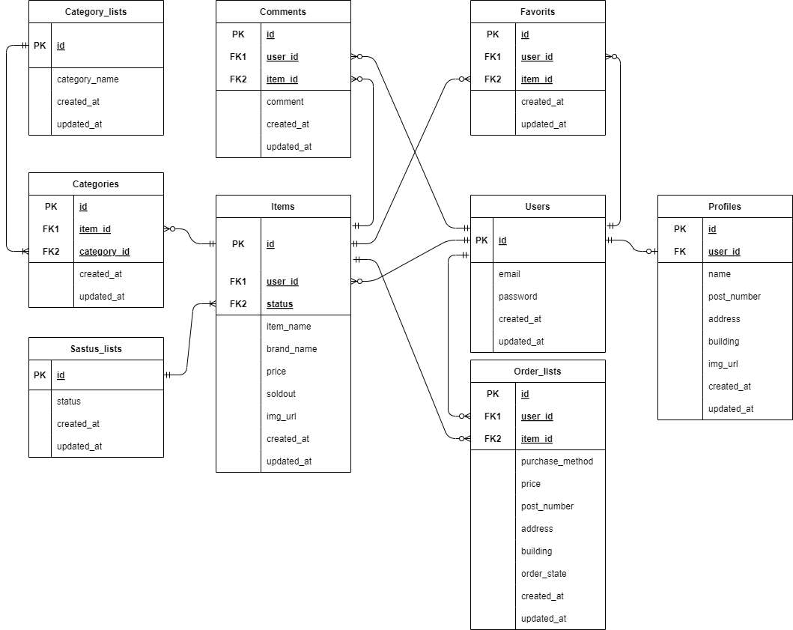

# 実践学習ターム 模擬案件初級_フリマアプリ 

 
 
## 概要 
- サービス名　；　coachtechフリマ
- 機能　　　　：　アイテムの出品と購入を行うためのフリマアプリ
- システム要件：　案件シート内の機能要件・非機能要件等記載  
   
## 環境構築  
1. Dockerビルド  
(1) 導入したいディレクトリへ移動し、githubからリポジトリを複製
```
git clone git@github.com:hirobot3103/furima-coachtech.git
```
(2) 個人が持つgithubアカウントでログインし、リモートリポジトリを作成  
(3) (1)で作成したディレクトリへ移動し、現在のローカルリポジトリのデータをリモートリポジトリに反映させる。  
```
git remote set-url origin 作成したリポジトリのurl
```
(4) 作成したリモートリポジトリに対し、最初のPUSHを行う。
```
git add .
git commit -m "リモートリポジトリの変更"
git push origin main
```
(5). Dockerコマンドを入力し、開発環境を構築
```
$ docker-compose up -d --build
```
＊最初のビルドでは、完了までに時間を要す場合いがあります。  

2. Laravelの設定等
(1) 複製したリポジトリ内の src/.envファイルなどを編集していきます。
``` 

```

() 実際にブラウザ上での動作確認のため、事前にユーザーデータを作成しています。  
- ログイン用データ  
email|password  
-|-  
user1@frima.com|password1  
user2@frima.com|password2  
user3@frima.com|password5  
user4@frima.com|password4  
user5@frima.com|password5  
  

## テスト環境と実施  
1. テスト項目
- D項目：　1,2,3,4,5,6,7,8,9,10,12,13,14,15の14個(11番以外)


## 使用技術  
・PHP8.3  
・Laravel 10  
・MySQL 8.0.26  

## URL  
Github git@github.com:hirobot3103/contact-form-fashionablylate.git  
開発環境　http://locaohost:80/ , http://locaohost:8080   

## ER図  
- テーブル仕様書については、案件シート内に記載



